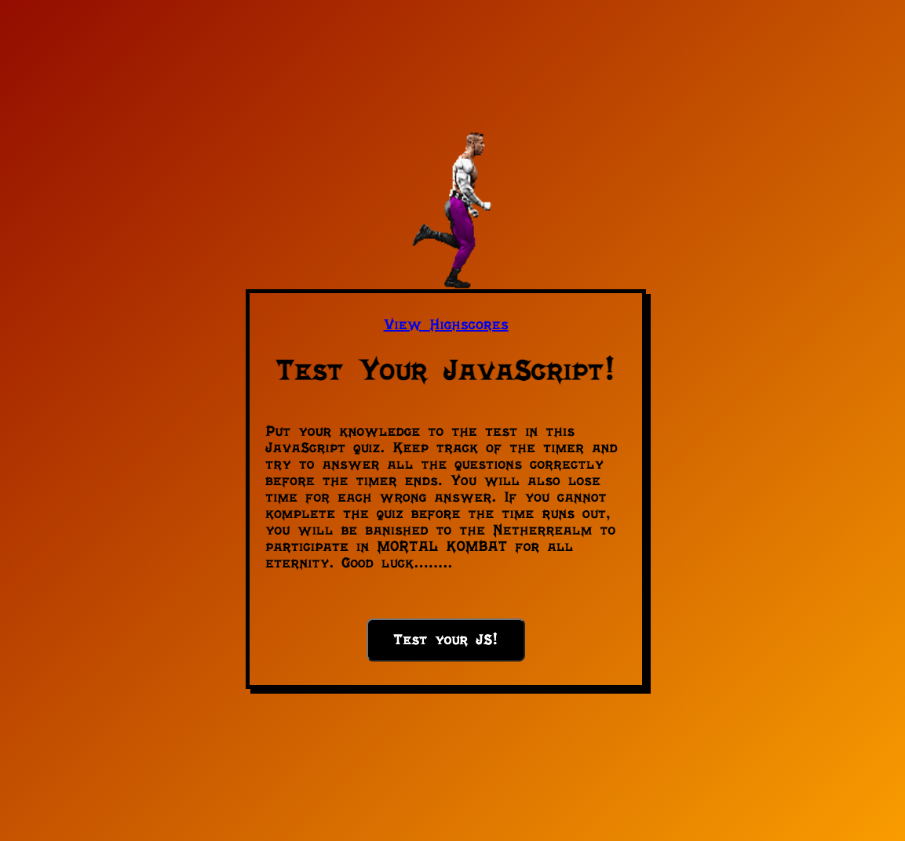

Description

For this assignement we had to create a JavaScript quiz. I used the example questions in class description for the 
JavaScript questions. What you will see happeneing in the code is a timer counting down, elements created through 
JavaScript, event listeners, appending and local storage. 

I had a little fun with this one. I originally wanted to do more with the Mortal Kombat theme, but just ran out of time due to traveling. I want to go back and add music, sounds and other character just for fun. 

I got the cool animated sprite from CodePen:
https://codepen.io/leglock/pen/qBOZGEa

Mortal Kombat Font Family:
https://fonts.cdnfonts.com/css/mortal-kombat

Here is my website link:
https://xboboyx.github.io/test-your-might/index.html



## User Story

```
AS A coding boot camp student
I WANT to take a timed quiz on JavaScript fundamentals that stores high scores
SO THAT I can gauge my progress compared to my peers
```

## Acceptance Criteria

```
GIVEN I am taking a code quiz
WHEN I click the start button
THEN a timer starts and I am presented with a question
WHEN I answer a question
THEN I am presented with another question
WHEN I answer a question incorrectly
THEN time is subtracted from the clock
WHEN all questions are answered or the timer reaches 0
THEN the game is over
WHEN the game is over
THEN I can save my initials and my score
